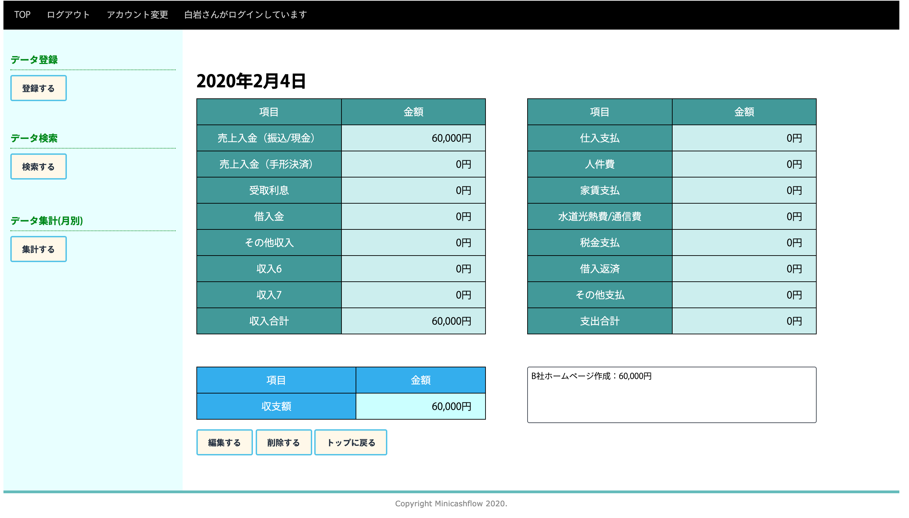
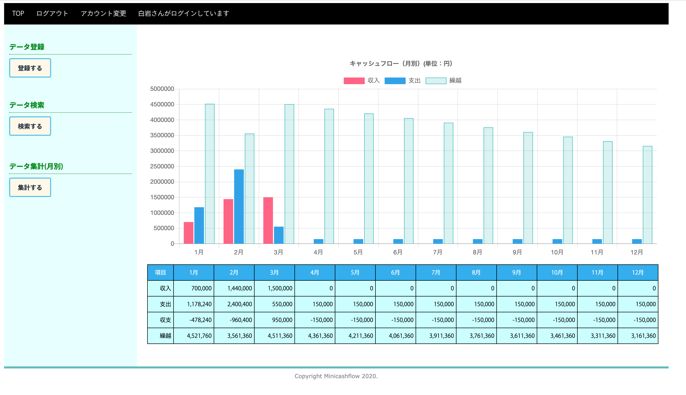
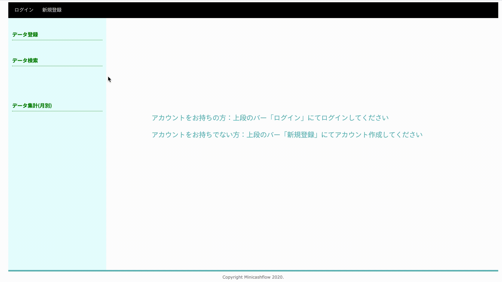
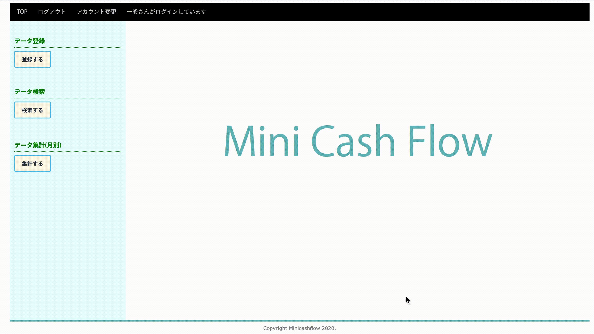

# MiniCashFlow

<png src="画像パス" width="100(px)">
<png src="画像パス" width="100(px)">
## *作成意図* 

  通常エクセルなどの表計算ソフトや経理ソフトで作成することが多い現金収支表ですが、中小、零細企業では下記理由で作成できていないケースが多く見られます。  
     1. 作成、管理する時間がない。  
     2. 市販の経理ソフトでは操作が難しい。  
  そこで簡単な操作機能で大枠で現金収支が把握できるアプリを作りたいと思い、作成しました。  
 *** 
 ## *機能*
 
   * データ登録（日別）
   * データ編集（日別）
   * データ集計（月別）（グラフにて自動表示）
   * アカウント情報変更

***

## *開発環境*

    ruby/Ruby on Rails/MySQL/Github/AWS/Visual Studio Code
    ・Rails 5.2.3 
    ・ruby 2.5.1
    ・chart-js-rails 0.1.4
    ・gon 6.2.0

***
## *開発期間*
  * 開発期間：1週間  
  * 1日あたりの平均作業時間：6〜8時間
  
***
 ## *接続先情報*
  * URL http://52.194.86.172/
  * ログインメールアドレス: admin@123
  * ログインパスワード: admin123
***
## *使用方法*
  ①トップ画面からログイン  

  ②サイドメニューバーから操作を選択  
  （データ登録）  
  * ③ー1 登録日を入力フィールドから選択し、該当箇所に金額入力。必要に応じて備忘記録も入力。  
       「登録する」ボタンを押し内容を確認。  
        修正する場合は「編集する」ボタンを、削除する場合は「削除」ボタンを押す。

  （データ検索）      
  * ③ー2 検索日を入力フィールドから選択すると、登録情報が表示される。  
  （登録情報がない場合はアラートが出る）。  検索は登録一覧（登録日順）からも選択可能。  

  
  （データ集計）
  * ③ー3 「集計する」ボタンを押すことで、現時点の登録データの月別集計値がグラフとデータにて表示。
  
 ***

## usersテーブル
|Column|Type|Options|
|------|----|-------|
|family_name|string|null: false|
|first_name|string|null: false|
|family_name_kana|string|null: false|
|first_name_kana|string|null: false|
|employee_number|integer|null: false|
|email|string|null: false|
|password|string|null: false|
|encrypted_password|string|null: false|

### Association
なし

## flowsテーブル
|Column|Type|Options|
|------|----|-------|
|year_month_day||null: false,unique: true|
|income1|integer|default: "0"|
|income2|integer|default: "0"|
|income3|integer|default: "0"|
|income4|integer|default: "0"|
|income5|integer|default: "0"|
|income6|integer|default: "0"|
|income7|integer|default: "0"|
|income8|integer|default: "0"|
|income9|integer|default: "0"|
|income_total|integer|default: ""|
|expense1|integer|default: "0"|
|expense2|integer|default: "0"|
|expense3|integer|default: "0"|
|expense4|integer|default: "0"|
|expense5|integer|default: "0"|
|expense6|integer|default: "0"|
|expense7|integer|default: "0"|
|expense8|integer|default: "0"|
|expense9|integer|default: "0"|
|expense_total|integer|default: ""|
|text|string||
### Association
なし

